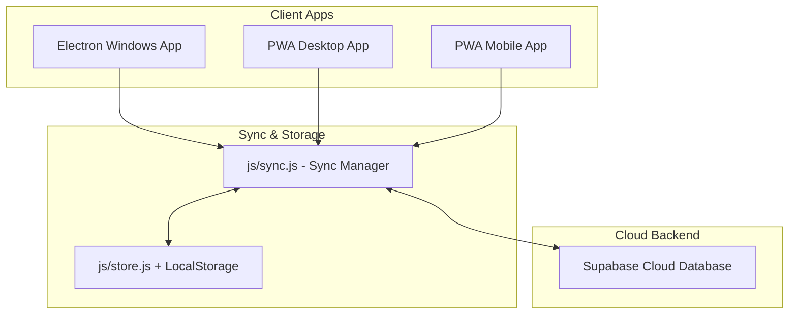

# ☁️ Cloud Syncing (Supabase) & Standalone App (PWA + Electron) Plan

This plan details how we will integrate a free, secure, and private cloud database (Supabase) to sync your life dashboard data seamlessly across all your devices, and package the application into a standalone Progressive Web App (PWA) and an Electron Desktop App (.exe).

---

## Proposed Architectural Overview



---

## Proposed Changes

### 1. Database Schema (Supabase)

To support seamless, robust, and offline-first syncing across multiple devices, we will implement a key-value style synchronization table in Supabase. This requires only a single, simple table that the user can set up with a one-click SQL query in their free Supabase dashboard:

```sql
-- DED Sync Table
create table if not exists public.ded_sync (
  id text primary key, -- maps to localStorage keys (e.g., 'gate_syllabus', 'gate_daily', 'gym_daily')
  data jsonb not null, -- JSON payload of the stored data
  updated_at timestamp with time zone default timezone('utc'::text, now()) not null
);

-- Enable RLS (Row Level Security) and allow all authenticated/anonymous operations with the Anon Key
alter table public.ded_sync enable row level security;
create policy "Allow all access with Anon Key" on public.ded_sync for all using (true) with check (true);
```

### 2. Synchronization Mechanism (`js/sync.js`) [NEW]
We will create a new sync module `js/sync.js` which manages:
- **Timestamp Tracking**: Tracks when each data group (GATE, Gym, Football) was last updated locally using a metadata key: `ded_sync_metadata`.
- **Sync Routine**:
  1. **Pull**: Fetch all rows from Supabase. Compare `updated_at` timestamps. If Supabase is newer, overwrite local storage.
  2. **Push**: For any local key where local timestamp is newer than Supabase's recorded timestamp (e.g. offline edits), upsert the local data to Supabase.
- **Connection Checks**: Gracefully handles offline mode by deferring syncs until connection is restored.

### 3. Settings View & Navigation (`js/settings.js` & `index.html`) [NEW]
We will build a modern, elegant Settings dashboard where the user can:
- Input their private **Supabase URL** and **Supabase Anon Key**.
- Click **Test Connection** to verify settings.
- Click **Sync Now** to trigger an manual synchronization with real-time status feedback.
- View a **Database Setup SQL** section with a one-click copy button to copy the table creation script.
- We will add a sleek **Settings (⚙️)** link or icon to the top navigation bar in `index.html` to easily toggle this view.

### 4. Progressive Web App (PWA) Support [NEW]
We will add PWA files in the root directory:
- `manifest.json`: Defines app metadata, name, themed dark background colors, and the icon.
- `service-worker.js`: Handles caching of static resources (`index.html`, CSS, and JS modules) for instant startup and offline capability.
- Register the service worker in `index.html` to make the app fully installable on PC, Mac, iOS, and Android!

### 5. Electron Desktop App Wrapper [NEW]
We will add files to support a standalone Windows `.exe` bundle:
- `main.js`: The Electron entry script that boots a borderless Chromium frame and loads `index.html`.
- `package.json`: Configures scripts (`npm run start`, `npm run build`) and dependencies (`electron`).

---

## Detailed File Changes

### [MODIFY] [index.html](file:///c:/Users/mahar/Documents/DED%20-%20Did%20Every%20Day/index.html)
- Load Supabase CDN script `<script src="https://cdn.jsdelivr.net/npm/@supabase/supabase-js@2"></script>`.
- Load new script modules: `js/sync.js` and `js/settings.js`.
- Add a Settings link with a modern gear/cog icon (⚙️) to the `.nav-links` container.
- Register the PWA service worker at the bottom.

### [NEW] [sync.js](file:///c:/Users/mahar/Documents/DED%20-%20Did%20Every%20Day/js/sync.js)
- Implement `SyncManager` namespace:
  - `init()`: Starts automatic background sync if Supabase is configured.
  - `sync()`: Runs the bidirectional merge algorithm (Pulls newer changes, Pushes offline local changes).
  - `saveLocal(key, data)`: Wraps `Store` writes to automatically update the local timestamp and trigger an background push.
  - `testConnection(url, key)`: Utility to verify Supabase credentials.

### [NEW] [settings.js](file:///c:/Users/mahar/Documents/DED%20-%20Did%20Every%20Day/js/settings.js)
- Implement `SettingsDashboard` view controller:
  - Form layout for Supabase URL and Anon Key.
  - Sync stats (Last sync status, sync timestamp, local vs cloud versions).
  - SQL editor card with the setup script and one-click copy button.
  - Clear local storage cache warning button (soft archival).

### [NEW] [manifest.json](file:///c:/Users/mahar/Documents/DED%20-%20Did%20Every%20Day/manifest.json)
- Define installable app properties.
- Use primary dark colors (theme color `#0a0a0f`, background color `#0a0a0f`).
- Standard app icons pointing to standard SVGs.

### [NEW] [service-worker.js](file:///c:/Users/mahar/Documents/DED%20-%20Did%20Every%20Day/service-worker.js)
- Service worker implementation caching CSS/JS modules for instant offline loads.

### [NEW] [main.js](file:///c:/Users/mahar/Documents/DED%20-%20Did%20Every%20Day/main.js)
- Create Electron app window, configure auto-hide menu bar, window sizing, and load `index.html`.

### [NEW] [package.json](file:///c:/Users/mahar/Documents/DED%20-%20Did%20Every%20Day/package.json)
- Define standard Node app dependencies and run scripts.

---

## Verification Plan

### Automated & Manual Verification
1. **PWA installation**: Run the dev server, open in Chrome/Edge, and verify the "Install DED" button appears in the URL bar. Verify the app installs as a standalone borderless window.
2. **Offline Mode**: Make changes to GATE journal offline, confirm it saves locally, and once sync is restored, verify that it updates in Supabase.
3. **Multi-device sync**: Load the app on a second device, enter credentials, and verify it pulls down all data recorded from the first device automatically.
4. **Electron Launch**: Run `npm run start` and verify it launches as a native desktop application frame.
